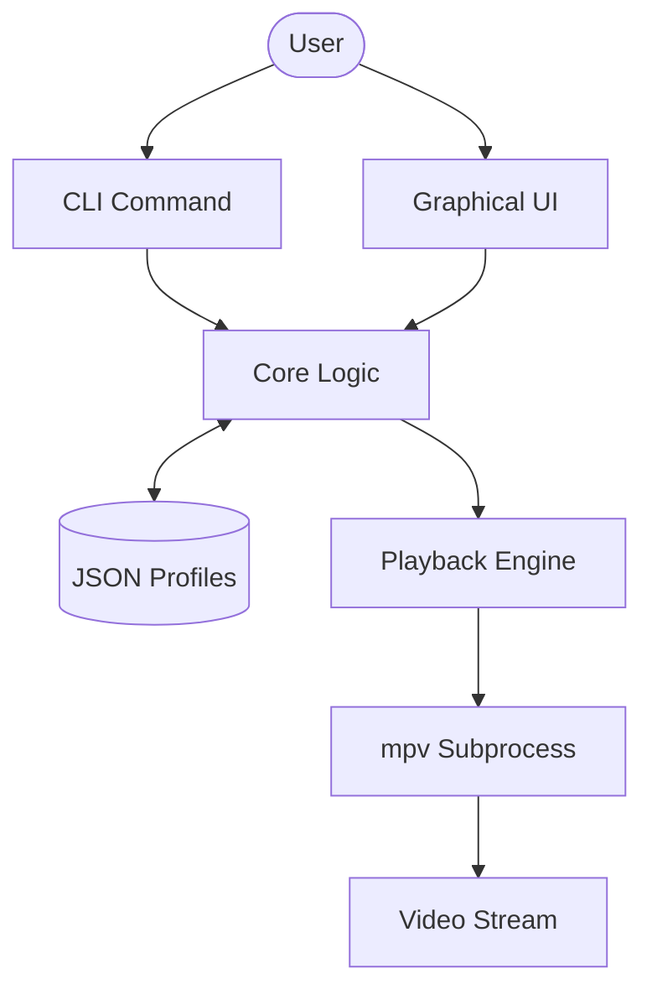

# Clip Stacks Code Documentation 🛠️

Project: `clip-stacks`
Goal: Stream video highlights using `mpv` timestamps without re-encoding.

---

## 1. Project Structure

| File / Folder | Purpose |
| :--- | :--- |
| `clip-stacks.py` | Main application script (logic + GUI + CLI). |
| `launch_clip_stacks.bat` | Windows launcher (detects `py`, `python`, `python3`). |
| `launch_clip_stacks.sh` | Unix launcher (runs `python3` + SIGINT/SIGTERM process handling). |
| `README.md` | General overview and usage guide. |
| `LICENSE` | GPL v3 license text. |
| `CODE_DOCUMENTATION.md` | Deep dive into codebase (this file). |
| `DESIGN_PHILOSOPHY.md` | Rationale and core principles. |
| `CONTRIBUTING.md` | Guide for community contributions. |

---

## 2. High-Level Architecture

`clip-stacks` is a standalone Python application that acts as a wrapper around the `mpv` player.

1.  **Data Layer**: JSON-based profiles stored in `~/.clip-stacks/profiles/`.
2.  **Core Logic**: Functions to parse timestamps, load/save profiles, and manage segments.
3.  **Playback Engine**: Subprocess-based execution of `mpv` with specific start/end flags.
4.  **Interface Layer**: Two-mode interface:
    -   **CLI**: Using `argparse` for rapid segment management and playback.
    -   **GUI**: Using `tkinter` for interactive editing and profile browsing.

---

## 3. Core Modules & Functions

### Profile Management
- `load_profile(name)`: Reads JSON using UTF-8. Includes **Segment Normalization** (validating video paths, times, and auto-labels) to ensure clean data for the UI engine.
- `_sanitize_name(name)`: Strips path-traversal characters and handles Windows-reserved file names.
- `save_profile(name, data)`: Persists profile as formatted JSON using **Atomic Writes** (`.tmp` → `os.replace`) to prevent corruption during failures.
- `create_segment(...)`: Shared logic to validate timestamps (ensuring non-negative times) and return a standardized segment dictionary.
- `add_segment(...)`: Back-end wrapper for CLI/GUI to create and append segments.

### Segment Editing
- `_edit_segment()`: GUI-exclusive. Loads segment data into the form and enters "Edit Mode".
- `_cancel_edit()`: Reverts the form to "Add Mode".
- `edit` (CLI): Command to modify specific segments based on their index.

### Help & Utils
- `parse_time(t)`: Logic for `H:MM:SS` parsing (crucial for CLI).
- `_set_hms()` / `_get_hms()`: GUI helpers to sync spinboxes with float seconds.
- `fmt_time(s)`: String formatting for UI and CLI display.
- `find_mpv()`: Binary path discovery with **shutil caching** to prevent redundant scans.
- `get_video_duration(video_path)`: Async-ready duration fetching via `ffprobe` or `mpv`.

### Playback Engine
- `play_profile(profile, start_index)`: Iterates through segments starting from `start_index` and spawns `mpv` processes sequentially.
- `_do_play(start_idx)`: Orchestrates playback from the GUI. It ensures the profile is **automatically saved** (`_save_profile`) before spawning the playback thread.

---

## 4. Data Flow

---

## 5. Dependencies

### Runtime
- **Python 3.8+**: Language runtime.
- **mpv**: Required for video playback. Must be in system `PATH`.

### Optional
- **tkinter**: Required for the `--gui` mode (standard on most Python installs).
- **ffprobe**: Speeds up video duration detection.
- **python-mpv**: (Placeholder) Hook for future embedded playback support.

---

## 6. Execution Flow

1.  **Entry Point**: `cli_main()` parses arguments.
2.  **Mode Switch**:
    -   If `--gui` or no command: `gui_main()` launches `ClipStacksApp`.
    -   Else: Routes to CLI sub-command handlers (`p_play`, `p_add`, etc.).
3.  **IO**: File data is loaded from `Path.home() / ".clip-stacks" / "profiles"`.
4.  **Edit Loop**: GUI maintains an `_edit_index` to toggle between adding new segments and updating selected ones.
5.  **Playback**: Each segment triggers a synchronous `subprocess.run([mpv, ...])` call. In GUI mode, this runs in a **background thread** to keep the interface responsive.
6.  **Error Handling**: A **Global Error Trap** in the entry point catches fatal exceptions. Support scripts like `launch_clip_stacks.sh` also perform **App Entry Checks** before launching.
7.  **Termination**: `mpv` exit codes are monitored (e.g. `4` for user-quit). The bash launcher now traps **SIGINT** and **SIGTERM** to specifically kill the app process (`APP_PID`), preventing orphaned player instances.
